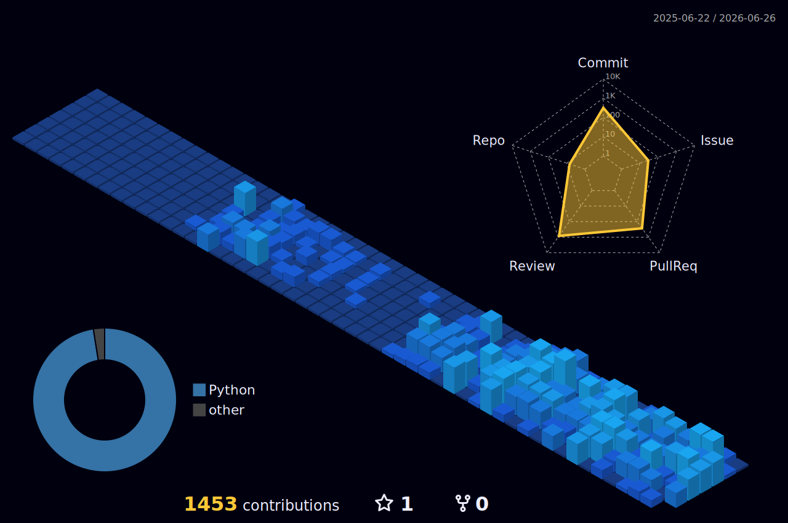

## About

Infrastructure engineer at **ByteDance**, focused on building context management systems for AI agents.

Co-creator of **[MineContext](https://github.com/volcengine/MineContext)** and **[OpenViking](https://github.com/volcengine/OpenViking)** — open-source tools that help AI agents manage memory, resources, and skills.

## Featured Projects

<table>
<tr>
<td width="50%">

### 🧠 MineContext
**Your proactive context-aware AI partner**

Context-Engineering + ChatGPT Pulse — an intelligent context management system that understands what you need before you ask.

</td>
<td width="50%">

### ⚔️ OpenViking
**Open-source context database for AI agents**

Unifies management of context — memory, resources, and skills — that agents require to operate effectively.

</td>
</tr>
</table>

## 3D Contribution Calendar

<picture>
  <source media="(prefers-color-scheme: dark)" srcset="./profile-3d-contrib/profile-night-view.svg" />
  <source media="(prefers-color-scheme: light)" srcset="./profile-3d-contrib/profile-green-animate.svg" />
  
</picture>

## Trophies

---

*"Context is all you need."*

